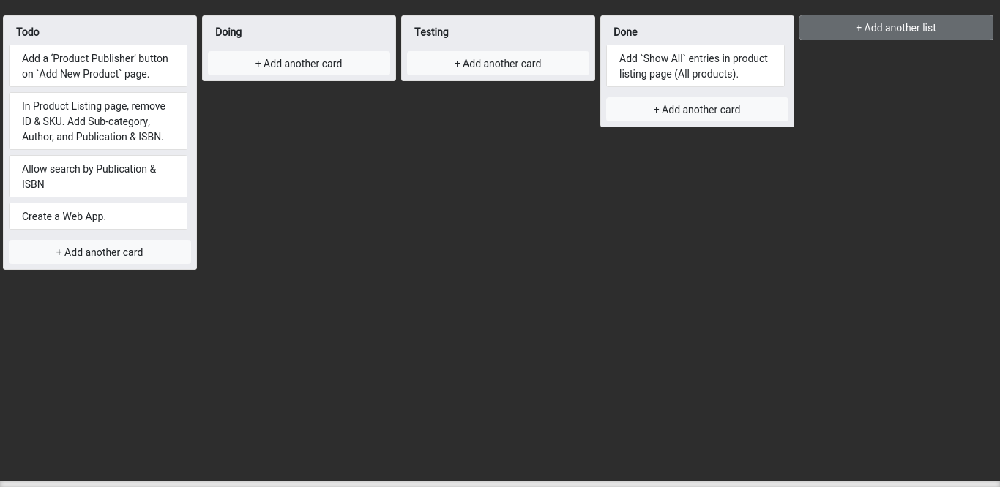

# Kanban Board

A kanban board is an agile project management tool designed to help visualize work, limit work-in-progress, and maximize efficiency (or flow). Kanban boards use cards, columns, and continuous improvement to help technology and service teams commit to the right amount of work, 

https://kritish-dhaubanjar.github.io/trello-board/

